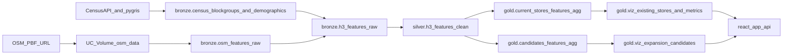

# CARTO-Free Census + OSM (Volume) Implementation Plan

## Objective

Replace CARTO Marketplace H3 feature dependency with first-party feature engineering from US Census + OSM PBF data stored in Unity Catalog Volumes, with full pipeline and app compatibility.

## Design Principles

- Preserve downstream contracts where possible (`silver.h3_features_clean`, `gold.viz_*`) to avoid app regressions.
- Separate concerns: OSM artifact management (download/version/freshness) vs feature engineering (H3 aggregation).
- Support multi-state training (`state_filter`) while preserving expansion-state targeting (`expansion_state`).

## End-to-End Data Flow

## Phase 1: Bronze (new source-of-truth features)

- **OSM artifact ingestion to Volume**
  - Add/extend bronze logic to download and store OSM PBF in UC Volume (`osm_data`).
  - Include idempotent refresh behavior, checksum/timestamp metadata, and safe retries.
  - Candidate file(s): [databricks.yml](/Users/jonathan.whiteley/Desktop/Databricks_Apps/projects/geospatial/geospatial-retail-site-selection/databricks.yml), [resources/bronze_job.yml](/Users/jonathan.whiteley/Desktop/Databricks_Apps/projects/geospatial/geospatial-retail-site-selection/resources/bronze_job.yml).
- **OSM parse and categorization**
  - Parse PBF into raw OSM feature table and map OSM tags into CARTO-compatible buckets:
    - `retail`, `food_drink`, `leisure`, `education`, `healthcare`, `financial`, `tourism`, `transportation`.
  - Keep branded POI flow (`raw_pois`) for partner/competitor app overlays unless intentionally unified.
  - Candidate file(s): [transformations/01_bronze/ingest_pois.ipynb](/Users/jonathan.whiteley/Desktop/Databricks_Apps/projects/geospatial/geospatial-retail-site-selection/transformations/01_bronze/ingest_pois.ipynb), [resources/configs/poi_config.yml](/Users/jonathan.whiteley/Desktop/Databricks_Apps/projects/geospatial/geospatial-retail-site-selection/resources/configs/poi_config.yml).
- **Census multi-state readiness**
  - Update Census ingestion to support multiple states from `state_filter`/list (not single `state_fips` only).
  - Ensure 20-34 age bins are fully available for `target_demographic_total` derivation.
  - Candidate file(s): [transformations/01_bronze/ingest_census.ipynb](/Users/jonathan.whiteley/Desktop/Databricks_Apps/projects/geospatial/geospatial-retail-site-selection/transformations/01_bronze/ingest_census.ipynb), [resources/configs/census_variables.yml](/Users/jonathan.whiteley/Desktop/Databricks_Apps/projects/geospatial/geospatial-retail-site-selection/resources/configs/census_variables.yml).
- **Build bronze H3 feature base**
  - Create `bronze.h3_features_raw` from Census + OSM aggregated at H3 resolution 8.
  - Include raw columns needed to preserve silver derivations.
  - Candidate file: [transformations/01_bronze/ingest_h3_features.ipynb](/Users/jonathan.whiteley/Desktop/Databricks_Apps/projects/geospatial/geospatial-retail-site-selection/transformations/01_bronze/ingest_h3_features.ipynb) (new).

## Phase 2: Silver (contract-preserving refactor)

- Refactor `clean_h3_features` to consume `bronze.h3_features_raw` instead of CARTO table.
- Replace `carto_table` parameter with `h3_features_table` and retain output schema/column names expected by gold.
- Keep or redefine:
  - `target_demographic_total`
  - `total_poi_count`
  - `urbanity_category`
  - `human_activity_index` (or deterministic replacement metric)
- Candidate file(s):
  - [transformations/02_silver/clean_h3_features.ipynb](/Users/jonathan.whiteley/Desktop/Databricks_Apps/projects/geospatial/geospatial-retail-site-selection/transformations/02_silver/clean_h3_features.ipynb)
  - [resources/silver_job.yml](/Users/jonathan.whiteley/Desktop/Databricks_Apps/projects/geospatial/geospatial-retail-site-selection/resources/silver_job.yml)

## Phase 3: Gold (feature parity + model stability)

- Keep gold pipeline interfaces unchanged initially; validate all joins/aggregations against updated silver features.
- Rebaseline ML if feature distributions shift:
  - compare RMSE/MAE and top-N ranking stability against CARTO baseline.
- Validate viz outputs powering app and Genie tables.
- Candidate file(s):
  - [transformations/03_gold/agg_h3_features_current_stores.ipynb](/Users/jonathan.whiteley/Desktop/Databricks_Apps/projects/geospatial/geospatial-retail-site-selection/transformations/03_gold/agg_h3_features_current_stores.ipynb)
  - [transformations/03_gold/agg_h3_features_candidates.ipynb](/Users/jonathan.whiteley/Desktop/Databricks_Apps/projects/geospatial/geospatial-retail-site-selection/transformations/03_gold/agg_h3_features_candidates.ipynb)
  - [transformations/03_gold/predict_candidate_sales.ipynb](/Users/jonathan.whiteley/Desktop/Databricks_Apps/projects/geospatial/geospatial-retail-site-selection/transformations/03_gold/predict_candidate_sales.ipynb)
  - [transformations/03_gold/viz_layer_prep.ipynb](/Users/jonathan.whiteley/Desktop/Databricks_Apps/projects/geospatial/geospatial-retail-site-selection/transformations/03_gold/viz_layer_prep.ipynb)
  - [resources/gold_job.yml](/Users/jonathan.whiteley/Desktop/Databricks_Apps/projects/geospatial/geospatial-retail-site-selection/resources/gold_job.yml)

## Phase 4: Bundle and Job Configuration

- Update bundle vars:
  - Remove `carto_table`.
  - Add OSM volume parameters (e.g., `osm_pbf_url`, `osm_pbf_filename`, `osm_volume_path`, refresh mode).
  - Add multi-state ingestion controls where needed.
- Add/sequence bronze tasks:
  - OSM download-to-volume -> OSM parse/categorize -> H3 feature build.
- Candidate file(s):
  - [databricks.yml](/Users/jonathan.whiteley/Desktop/Databricks_Apps/projects/geospatial/geospatial-retail-site-selection/databricks.yml)
  - [resources/bronze_job.yml](/Users/jonathan.whiteley/Desktop/Databricks_Apps/projects/geospatial/geospatial-retail-site-selection/resources/bronze_job.yml)
  - [resources/catalog_setup.yml](/Users/jonathan.whiteley/Desktop/Databricks_Apps/projects/geospatial/geospatial-retail-site-selection/resources/catalog_setup.yml)

## Phase 5: App and API Compatibility

- Ensure app-facing gold tables keep required fields:
  - `viz_existing_stores`: `population`, `poi_count/total_poi_count`, geometry/coords.
  - `viz_expansion_candidates`: `predicted_annual_sales`, `population`, `total_poi_count`, partner/fulfillment columns.
- Validate backend API loaders and frontend filters/panels without schema changes.
- Candidate file(s):
  - [react-app/services/data_service.py](/Users/jonathan.whiteley/Desktop/Databricks_Apps/projects/geospatial/geospatial-retail-site-selection/react-app/services/data_service.py)
  - [react-app/frontend/src/components/map/GeospatialMap.jsx](/Users/jonathan.whiteley/Desktop/Databricks_Apps/projects/geospatial/geospatial-retail-site-selection/react-app/frontend/src/components/map/GeospatialMap.jsx) (tile provider optional, independent of CARTO table removal)

## Phase 6: Permissions and Documentation

- Remove CARTO Marketplace permission requirements.
- Add/confirm UC Volume permissions and operational guidance for OSM artifacts.
- Update architecture/source docs to reflect Census + OSM ownership.
- Candidate file(s):
  - [docs/PERMISSIONS.md](/Users/jonathan.whiteley/Desktop/Databricks_Apps/projects/geospatial/geospatial-retail-site-selection/docs/PERMISSIONS.md)
  - [README.md](/Users/jonathan.whiteley/Desktop/Databricks_Apps/projects/geospatial/geospatial-retail-site-selection/README.md)

## Validation Gates Before Cutover

- **Bronze:** PBF freshness, parse success rate, expected row counts by state/category.
- **Silver:** strict schema checks on `h3_features_clean`; null/range checks for derived fields.
- **Gold:** aggregate parity and drift checks for model features and viz tables.
- **Model:** acceptable metric deltas and stable candidate ranking.
- **App:** API smoke tests (`/api/init`, `/api/expansion/candidates`, `/api/metrics/network`) + UI filter sanity.

## Rollout Strategy

- Run dual-path (CARTO and Census+OSM) for one full cycle.
- Compare gates, then promote Census+OSM path as default.
- Remove CARTO variable/task/docs once parity criteria pass and app behavior is verified.
