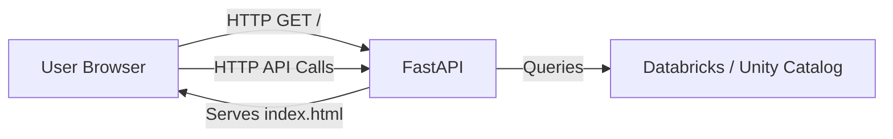

# Migration Plan: Streamlit to React + FastAPI

This document outlines the plan to migrate an existing Streamlit application to a React (Vite) frontend served by a FastAPI backend, adhering to Databricks deployment guidelines.

## 1. Architecture Overview

**Goal**: Split the monolithic Streamlit app into a decoupled Client-Server architecture.

- **Frontend**: React + Vite (Static Single Page Application).
  - _Styling_: Tailwind CSS + shadcn/ui (reusing `retail1-dashboard` styles).
- **Backend**: FastAPI (Python).
  - _Role_: API endpoints for data processing + Static file server for the frontend.
- **Deployment**: Databricks Apps (hosting the FastAPI server).



## 2. Implementation Steps

### Phase 1: Project Scaffolding

Create the structure required by `databricks_frontend_deployment.md`.

1.  **Initialize Project Root**:

    ```text
    my-new-app/
    ├── app.yaml            # Databricks App Manifest
    ├── backend/
    │   ├── app.py          # FastAPI Entry Point
    │   └── requirements.txt
    └── frontend/
        ├── package.json
        ├── vite.config.js
        └── src/
    ```

2.  **Frontend Setup (React + Vite)**:

    - Initialize: `npm create vite@latest frontend -- --template react`
    - Install Dependencies: `npm install -D tailwindcss postcssautoprefixer && npx tailwindcss init -p`
    - Install Utils: `npm install clsx tailwind-merge class-variance-authority lucide-react`

3.  **Applying the Style System (The "Retail App" Look)**:
    - **Config**: Copy the `tailwind.config.js` content from reference (see Section 4).
    - **CSS**: Replace `src/index.css` with the reference CSS (see Section 4).
    - **Utils**: Create `src/lib/utils.js` for shadcn `cn()` helper.

### Phase 2: FastAPI Backend Setup

1.  **Dependencies**: `fastapi`, `uvicorn`, `standard-imghdr` (if needed for images).
2.  **`app.py` Structure**:

    ```python
    from fastapi import FastAPI
    from fastapi.staticfiles import StaticFiles
    from pathlib import Path

    app = FastAPI()

    # 1. API Routes (Ported from Streamlit logic)
    @app.get("/api/data")
    async def get_data():
        return {"data": "..."}

    # 2. Static File Serving (Crucial for Databricks)
    # Serves the 'dist' folder generated by Vite
    build_dir = Path(__file__).parent.parent / "frontend" / "dist"
    if build_dir.exists():
        app.mount("/", StaticFiles(directory=build_dir, html=True), name="static")
    ```

### Phase 3: Porting Logic (The "LLM Task")

For each Streamlit component:

1.  **Identify State**: usage of `st.session_state` becomes React `useState` or `useContext`.
2.  **Identify Interactions**: `st.button`, `st.selectbox` become React event handlers calling API endpoints.
3.  **Identify Data**: `st.dataframe` or pandas manipulations move to FastAPI endpoints returning JSON.

**Mapping Table**:

| Streamlit               | React + FastAPI                                                                                                  |
| :---------------------- | :--------------------------------------------------------------------------------------------------------------- |
| `st.title("Hello")`     | `<h1>Hello</h1>`                                                                                                 |
| `st.sidebar`            | Fixed Sidebar Component (CSS Grid/Flex)                                                                          |
| `df = pd.read_sql(...)` | **Backend**: `pd.read_sql` -> `df.to_dict(orient='records')` <br> **Frontend**: `const { data } = useQuery(...)` |
| `st.plotly_chart(fig)`  | `recharts` or `react-plotly.js` component                                                                        |

### Phase 4: Build & Deployment

1.  **Build Frontend**: Run `npm run build` in `frontend/`.
2.  **Commit Artifacts**: Commit `frontend/dist` to git (as per deployment guide).
3.  **App Manifest**: Ensure `app.yaml` points to `backend/app.py`.

## 3. Deployment Compliance Checklist

- [ ] **Serving Strategy**: FastAPI mounts `frontend/dist` at root `/`.
- [ ] **API Prefix**: All backend routes start with `/api/` to avoid collision with frontend routing.
- [ ] **Environment**: Use `os.getenv` in Python for secrets (Databricks injects these).
- [ ] **Vite Config**: Set `base: '/'` in `vite.config.js`.

## 4. Styling References (For Agents)

Use these contents to replicate the "Retail App" styling.

### `tailwind.config.js`

> **Action**: Use the content from `app/app/tailwind.config.js`. Key features:
>
> - `darkMode: ["class"]`
> - Extended colors: `databricks-*`, `walgreens-*`, `chart-*`.
> - Custom font sizes (`display-1`, `body-lg`).

### `src/index.css`

> **Action**: Use the content from `app/app/src/index.css`. Key features:
>
> - `@layer base` defining CSS variables for HSL colors.
> - `.databricks-*` utility classes.
> - `.expo-pulsing-marker` animations.

### `src/lib/utils.js` (Standard shadcn chain)

```javascript
import { clsx } from "clsx";
import { twMerge } from "tailwind-merge";

export function cn(...inputs) {
  return twMerge(clsx(inputs));
}
```

## 5. Next Steps

1.  **Confirm Target**: Where is the Streamlit app you want to migrate?
2.  **Execute Scaffolding**: Shall I set up the `frontend/` and `backend/` directories now?
